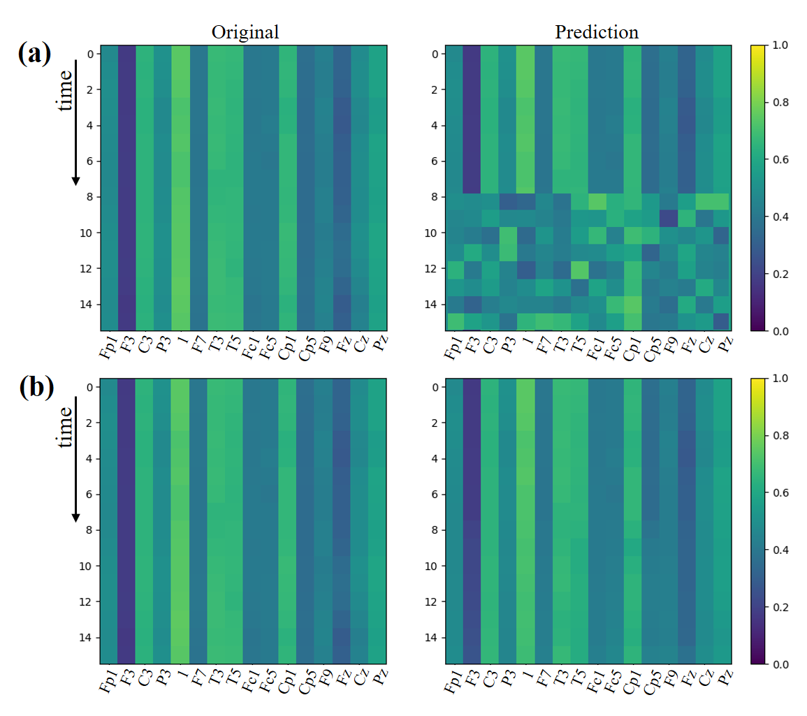

# EEG-DIF

## Introduction
Early Warning of Epileptic Seizures through Generative Diffusion Model-based Multi-channel EEG Signals Forecasting. 

Here, we provide a clean version of the EEG-DIF algorithm, allowing users to run the code on any EEG data to achieve future predictions for any time frame. This research is ongoing, and additional updates or code uploads will be made in the future.

The EEG-DIF algorithm:


## Dataset
Siena Scalp EEG Database (PhysioNet). You can download the datasets from https://physionet.org/content/siena-scalp-eeg/1.0.0/.

## Installation
This project is based on Pytorch.
You can use the following command to install the Pytorch.

### Create a virtual enviroment
```bash
conda create -n EEGDiff python=3.9
conda activate EEGDiff
```

linux user
```bash
pip3 install torch torchvision torchaudio
pip install -r requirements.txt
```

windows user
```bash
pip3 install torch torchvision torchaudio --index-url https://download.pytorch.org/whl/cu117
pip install -r requirements.txt
```

MacOS user
```bash
pip3 install torch torchvision torchaudio
pip install -r requirements.txt
```

## Forecasting Model Training
You should fill your wandb key in:
```bash
/train_eegdiff.py
```

Then, you can use the following command to train your model.
```bash
python train_eegdiff.py
```

## Forecasting Model Inference
You can use the following command to test your model.
```bash
python test_eegdiff.py
```
## Forecasting Results
You can see some prediction results by using this code, like:


And you can also calculate the corresponding prediction metrics. You can save the generated future data locally and then run the classification code to carry out early diagnosis and warning of related diseases. Our code is an initial version that offers a novel solution and approach, and we welcome everyone to further improve and enhance it based on this foundation.

If you find this repo useful for your research, please consider citing our papers:

```bibtex
@inproceedings{jiang2024eeg,
  title={EEG-DIF: Early Warning of Epileptic Seizures through Generative Diffusion Model-based Multi-channel EEG Signals Forecasting},
  author={Jiang, Zekun and Dai, Wei and Wei, Qu and Qin, Ziyuan and Li, Kang and Zhang, Le},
  booktitle={Proceedings of the 15th ACM International Conference on Bioinformatics, Computational Biology and Health Informatics},
  pages={1--1},
  year={2024}
}
@article{jiang2025diffusion,
  title={Diffusion Model-Based Multi-Channel EEG Representation and Forecasting for Early Epileptic Seizure Warning},
  author={Jiang, Zekun and Dai, Wei and Wei, Qu and Qin, Ziyuan and Wei, Rui and Li, Mianyang and Chen, Xiaolong and Huo, Ying and Liu, Jingyun and Li, Kang and others},
  journal={Interdisciplinary Sciences: Computational Life Sciences},
  pages={1--12},
  year={2025},
  publisher={Springer}
}
